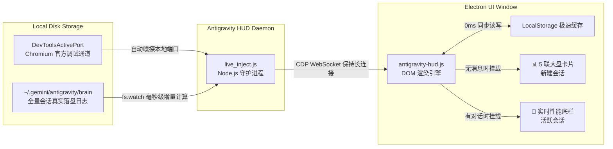

<div align="center">


# 🎯 Antigravity HUD

**Google Antigravity 官方桌面客户端实时状态栏与 5 联 Token 大盘**  
*平视每一个 Token、真实生成速率与官方等价额度 · 0 破坏官方文件 · 0ms 离线瞬开*

[English](README_EN.md) | 简体中文

<br/>

[](LICENSE)
[]()
[]()
[]()
[](CONTRIBUTING.md)

</div>

---

## 📸 视觉实机效果 (Visual Showcase)

### 1. 新建会话页面 · 5 联磨砂大盘卡片 (New Conversation 0ms 瞬开)
> 进入新建会话时，在输入框上方以精美磨砂质感秒开展示全局会话与 Token 统计。
<div align="center">
  
</div>

<br/>

### 2. 活跃会话页面 · 极简性能底栏 (Real-time Session HUD)
> 对话开始后，大盘平滑淡出，输入框下方常驻显示当前会话的轮数、步数、精准 TPS、缓存命中率与上下文消耗。
<div align="center">
  
</div>

---

## 📖 简介

在日常重度使用 **Google Antigravity** 客户端进行 AI 辅助编程与对话时，官方界面默认隐藏了所有底层的 Token 消耗、推理速度与上下文数据，开发者难以直观感知模型响应状态与额度开销。

**Antigravity HUD** 是一个专为 Google Antigravity 桌面客户端打造的**轻量、非侵入式实时状态栏与数据大盘**。它通过安全的本地 Chromium 调试通道（CDP）实现动态热注入，让你在完全不修改客户端任何程序包的前提下，随时平视掌握会话的全部性能指标！

---

## ✨ 核心特性

* 🛡️ **非侵入式 CDP 热注入（0 破坏、客户端升级无感适配）**
  * 彻底放弃修改官方 `app.asar` 等高风险做法；
  * 100% 保持官方应用程序签名与完整性，完全规避 Electron 沙盒权限冲突；
  * 无论官方如何频繁热更新或升级新版本，守护进程自动感知端口重连，**永不失效**。

* ⚡ **New Conversation 5 联大盘（LocalStorage 0ms 瞬开）**
  * 累计总对话数（近 7 天活跃指标）
  * 今日 Token 消耗（输入 / 输出用量精确分离）
  * 近 7 天消耗总量（活跃会话分布）
  * 历史累计总消耗（千万级 Token 统计）
  * 💰 **Gemini 3.8 Flash 官方额度精算**（按 Google 官方标准输入 \$0.75 / 缓存 \$0.075 / 输出 \$3.75 美元计费，含 90% 上下文缓存优惠）。
  * 深度固化至浏览器 LocalStorage，点击 `+ New Conversation` 首帧（< 0.1ms）瞬间完成渲染。

* ⏱️ **真实平均吐字速率（毫秒级多步骤积分算法）**
  * 拒绝简陋的人为限速或粗暴估算；
  * 基于真实模型生成周期的物理时间差（毫秒级）对每一步思考与输出进行积分累加，精准计算真实的 `tok/s`，真实还原 TPU 高爆发性能。

* 🎯 **智能双模无缝切换**
  * 新建会话显示 5 联大盘；
  * 用户发出第一条消息或切换至既有历史对话时，大盘平滑收起，自动无缝切换为输入框底部 HUD；
  * 自动跟随 Antigravity 系统明暗主题（Dark / Light）。

* 🖥️ **跨平台全端一键运行**
  * 原生兼容 **macOS**、**Windows** 与 **Linux**；
  * 零第三方 npm 依赖，无需繁重的 `npm install`，开箱即用。

---

## 🏗️ 架构原理解析



---

## 🚀 快速开始

### 前提条件
* 本机已安装 **Node.js 18.0+**（可在终端运行 `node -v` 验证）。
* 本机已安装并打开 **Google Antigravity** 客户端。

---

### macOS / Linux

```bash
# 1. 克隆本仓库
git clone https://github.com/xqingting/antigravity-hud.git
cd antigravity-hud

# 2. 一键启动服务 (后台常驻)
./start.sh

# 查看运行状态
./status.sh

# 停止服务
./stop.sh
```

---

### Windows (CMD 或 PowerShell)

#### CMD 批处理：
```bat
:: 双击或在命令行运行：
start.bat

:: 查看状态：
status.bat

:: 停止服务：
stop.bat
```

#### PowerShell：
```powershell
# 启动
.\start.ps1

# 停止
.\stop.ps1
```

> **提示**：启动后，直接在 Antigravity 中点击左上角 `+ New Conversation` 或切换任意对话，即可在窗口中看到实时效果！

---

## ❓ 常见问题 (FAQ)

### Q: Antigravity 自动更新版本后，状态栏会失效吗？
**A: 完全不会。**  
传统的注入方式通常是解包并覆盖 `/Applications/Antigravity.app` 内部的 `app.asar`，客户端一旦静默升级就会被全量覆盖失效。  
而 **Antigravity HUD** 采用 Chromium 官方原生的 **DevToolsActivePort** 调试协议热注入，所有脚本存放在外部目录，无论客户端升级到任何版本，守护进程都会自动重新建立连接并注入，**永久自适应升级**。

### Q: 这个工具会导致 Antigravity 软件卡顿或占用 CPU 吗？
**A: 几乎 0 额外开销。**  
1. 所有历史会话与大盘数据均在启动时一次性在后台解析并推入 LocalStorage，运行时不再重复读取磁盘；
2. 页面采用事件驱动型路由监听（劫持 `pushState` 与单次 MutationObserver），切页仅耗时 < 1ms，CPU 占用率低于 0.1%。

### Q: 会话底部的输出 Token 和速率是怎么算出来的？
* **输出 Token**：包含最终回复文字与 Thinking 深度思考过程的所有字符，按官方 BPE 标准加权折算。
* **速率 (tok/s)**：通过记录模型在思考和吐字过程中的实际物理耗时（毫秒级积分），除以实际生成的 Token 数量得出，真实展现每次推理的爆发与平均表现。

---

## 📄 开源协议

本项目基于 [MIT License](LICENSE) 许可开源。欢迎提交 Issue 与 Pull Request！
