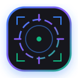
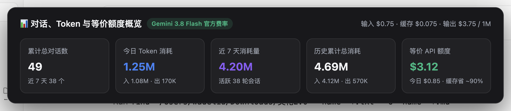
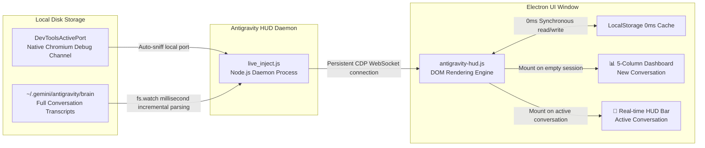

<div align="center">



# 🎯 Antigravity HUD

**Real-time Metrics HUD & 5-Column Token Dashboard for Google Antigravity Desktop Client**  
*Heads-up display for every Token, real-time generation speed (tok/s), and official equivalent costs · Zero-patch · 0ms Local Cache*

English | [简体中文](README.md)

<br/>

[](LICENSE)
[]()
[]()
[]()
[](CONTRIBUTING.md)

</div>

---

## 📸 Visual Showcase

### 1. New Conversation Page · 5-Column Frosted Overview Card (0ms Instant Load)
> Upon entering a new conversation, a sleek frosted card appears right above the input box in 0ms, displaying global conversation and token statistics.
<div align="center">
  
</div>

<br/>

### 2. Active Conversation Page · Real-time Session HUD Bar
> Once a conversation begins, the overview card smoothly disappears, replaced by a permanent bottom HUD bar showing turns, steps, exact TPS speed, cache hit rate, and input/output tokens.
<div align="center">
  
</div>

---

## 📖 Introduction

When using the **Google Antigravity** desktop client for heavy AI-assisted coding and agentic workflows, the official interface hides all token usage, inference speed, and context metrics. Developers are often left in the dark about performance and costs.

**Antigravity HUD** is a **lightweight, non-invasive real-time metrics bar and analytics dashboard** tailored specifically for the Google Antigravity desktop app. By utilizing Chromium's native DevTools Protocol (CDP), it performs dynamic hot-injection into the Electron window without touching any official app files or modifying `app.asar`!

---

## ✨ Key Features

* 🛡️ **Non-Invasive CDP Hot Injection (0-Patch, Resilient to Updates)**
  * No risky unpacking or overriding of `/Applications/Antigravity.app/Contents/Resources/app.asar`;
  * 100% preserves official application signatures and integrity;
  * Automatically detects the local debugging port and reconnects whenever Antigravity updates or restarts.

* ⚡ **New Conversation 5-Column Dashboard (0ms LocalStorage Instant Load)**
  * Total Conversations (with 7-day activity)
  * Today's Token Usage (Prompt & Completion breakdown)
  * Last 7 Days Token Usage
  * All-Time Cumulative Token Usage
  * 💰 **Gemini 3.8 Flash Official USD Equivalent Quota** (calculated with official rates: Input \$0.75 / Cached \$0.075 / Output \$3.75 per 1M, with 90% prompt caching discount).
  * Persisted in browser LocalStorage for instant 0ms rendering upon opening `+ New Conversation`.

* ⏱️ **Accurate Average Generation Rate (Physical Time-Delta Integration)**
  * Avoids artificial rate-capping or inaccurate estimations;
  * Calculates real-time `tok/s` across multiple thinking and tool-calling planner steps using actual millisecond timestamps.

* 🎯 **Seamless Dual-Mode Auto-Switching**
  * Displays the 5-column dashboard on new/empty sessions;
  * Smoothly collapses into the compact input box HUD bar upon sending the first message or navigating to existing conversations;
  * Automatically adapts to Antigravity Dark and Light themes.

* 🖥️ **Cross-Platform Out-of-the-Box**
  * Fully supports **macOS**, **Windows**, and **Linux**;
  * Zero third-party npm dependencies — purely built on standard Node.js libraries.

---

## 🏗️ Architecture



---

## 🚀 Quickstart

### Prerequisites
* **Node.js 18.0+** installed on your system (`node -v`).
* **Google Antigravity** desktop app installed and running.

---

### macOS / Linux

```bash
# 1. Clone the repository
git clone https://github.com/xqingting/antigravity-hud.git
cd antigravity-hud

# 2. Launch daemon in background
./start.sh

# Check status
./status.sh

# Stop daemon
./stop.sh
```

---

### Windows (CMD or PowerShell)

#### CMD Batch:
```bat
:: Double-click or run in CMD:
start.bat

:: Check status:
status.bat

:: Stop daemon:
stop.bat
```

#### PowerShell:
```powershell
# Start
.\start.ps1

# Stop
.\stop.ps1
```

> **Tip**: Once started, simply switch between any conversations in Antigravity or click `+ New Conversation` to see the live HUD and dashboard!

---

## ❓ Frequently Asked Questions (FAQ)

### Q: Will Antigravity client auto-updates break this tool?
**A: Not at all.**  
Traditional injection methods unpack and patch `app.asar`, which gets completely wiped out whenever the client silently updates.  
**Antigravity HUD** communicates via Chromium's native **DevToolsActivePort** debugging protocol. The daemon automatically discovers the new port and re-injects seamlessly across updates.

### Q: Does this cause lag or high CPU usage?
**A: Practically 0 extra overhead.**  
1. All past transcripts are parsed once during startup and pushed to LocalStorage;
2. Route changes are captured efficiently using lightweight browser event hooks (`pushState` / MutationObserver), taking < 1ms per page switch with CPU usage below 0.1%.

---

## 📄 License

This project is licensed under the [MIT License](LICENSE). Contributions and pull requests are welcome!
